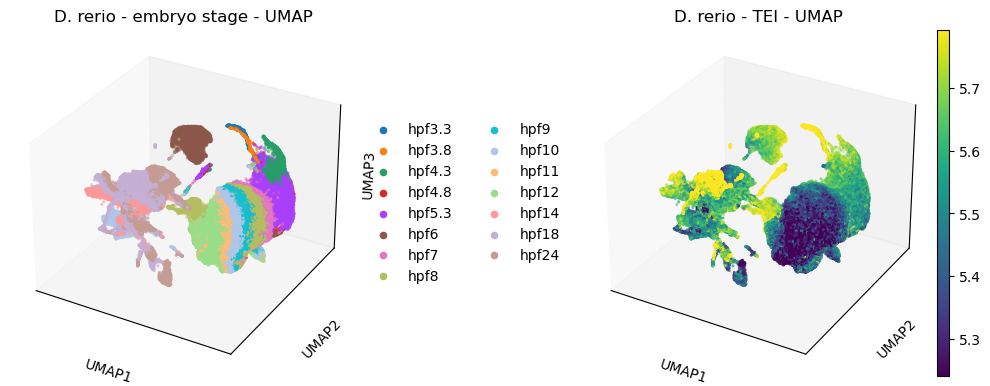

.. _doc_root:

Welcome to oggmap's documentation!
====================================
|GitHub Workflow Status| |PyPI| |PyPI - Python Version| |PyPI - Wheel| |Licence| |ReadTheDocs|

What is oggmap?
-----------------

`oggmap` is a python package that can:

- extract and assign lowest common ancestor (LCA) from orthologous groups as gene age class for a target species.

- match gene and transcript IDs and their corresponding gene age class with scRNA data sets.

- calculate and visualize transcriptome evolutionary index (TEI) on scRNA data sets.

- calculate and visualize partial transcriptome evolutionary index (TEI) profiles on scRNA data sets.

- show species lineage information from the `NCBI taxonomy <https://www.ncbi.nlm.nih.gov/taxonomy>`_ database.

- extract orthologous maps from `OrthoFinder <https://github.com/davidemms/OrthoFinder>`_ results.

- extract orthologous maps from `eggnog_6.0 <http://eggnog6.embl.de/>`_ results.

- extract orthologous maps from `PLAZA <https://bioinformatics.psb.ugent.be/plaza/>`_ results.

- extract gene and transcript information from GTF files (`GTF File Format <https://www.ensembl.org/info/website/upload/gff.html>`_).

- calculate mean/relative expression per gene age class.

- show number of expressed genes per gene age class.

.. image:: tutorials/img/oggmap_steps.png
   :width: 800px
   :align: center
   :alt: oggmap steps

Source code is available at `oggmap GitHub repository <https://github.com/kullrich/oggmap>`_
and at `PyPi <https://pypi.org/project/oggmap/>`_.

Table of Contents
-----------------

.. toctree::
   :caption: Documentation
   :maxdepth: 1

   installation/index
   citation/index
   contact/index
   license/index
   references/index

.. toctree::
    :maxdepth: 1
    :caption: Tutorials

    tutorials/index

.. toctree::
   :caption: API
   :maxdepth: 1

   modules/index
   changelog/index

.. |GitHub Workflow Status| image:: https://img.shields.io/github/actions/workflow/status/kullrich/oggmap/build_check.yml?branch=main
   :target: https://github.com/kullrich/oggmap/actions/workflows/build_check.yml
.. |PyPI| image:: https://img.shields.io/pypi/v/oggmap?color=blue
   :target: https://pypi.org/project/oggmap/
.. |PyPI - Python Version| image:: https://img.shields.io/pypi/pyversions/oggmap
   :target: https://pypi.org/project/oggmap/
.. |PyPI - Wheel| image:: https://img.shields.io/pypi/wheel/oggmap
   :target: https://pypi.org/project/oggmap/
.. |Licence| image:: https://img.shields.io/badge/License-GPLv3-blue.svg
   :target: https://www.gnu.org/licenses/gpl-3.0
.. |ReadTheDocs| image:: https://readthedocs.org/projects/oggmap/badge/?version=latest
   :target: https://oggmap.readthedocs.io/en/latest/?badge=latest
